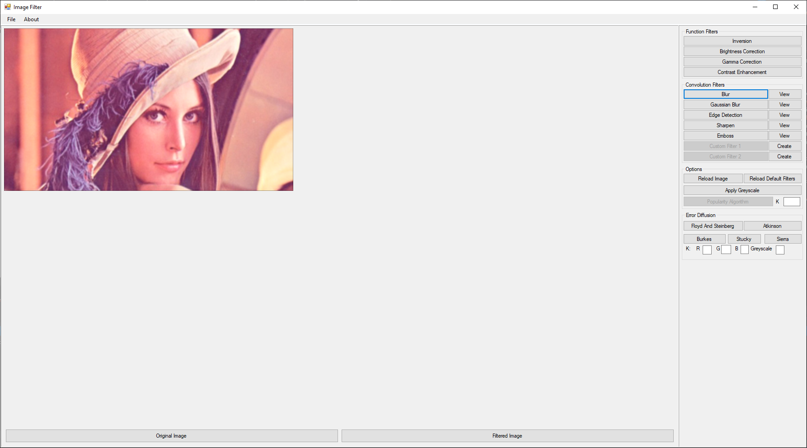

# filter-image-application
Application for using specific image filters on chosen image files

## Information
This project is a simple GUI-oriented application written in C# and WinForms. The functions provided by the application are:
- possibility to load chosen image
- application of chosen functional filter
- application of chosen covolutional filter
- possibility to modify existing convolutional filter
- option to add new convolutional filter with kernel chosen by the user
- possibility to test the custom popularity algorithm with chosen parameters on the chosen image 
- possibility to test the error diffusion algorithm with chosen parameters on the chosen image
- option to save the modified picture

## Usage

The application should be used in Visual Studio. User interface is simple, and all the action are accomplished by using specific buttons.
